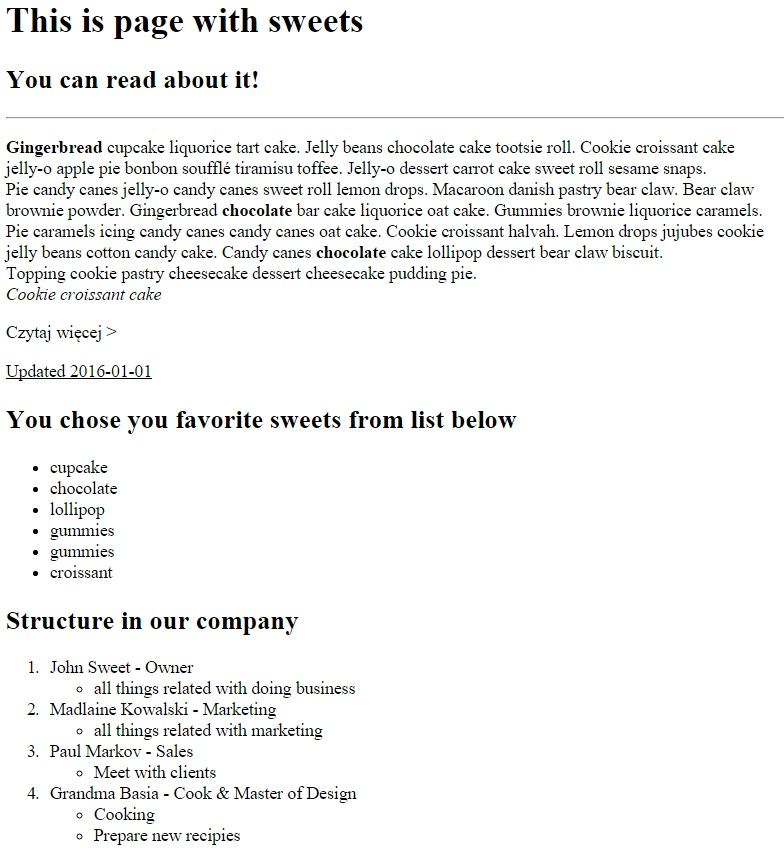

1. Na podstawie znanych elementów HTML, spróbuj stworzyć identyczną strukturę w index.html. Pamiętaj o odpowiednim zagnieżdżaniu elementów w liście ul. Jeśli nie pamiętasz jak zagnieżdżać elementy, wróć do slajdu "Zagnieżdżanie list" w prezentacji o HTML i CSS. Wzór znajduje się w folderze images. Tekst może być dowolny (bez znaczenia).
 