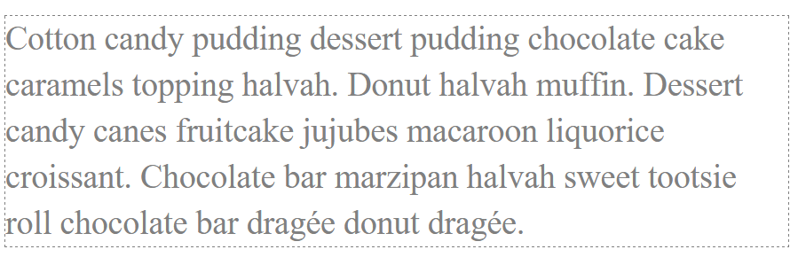

1. Stwórz 2 elementy div. Ustaw dowolną szerokość i wysokość dla każdego z nich w pliku style.css. Pamiętaj, aby ustawić im również obramowanie lub kolor tła jeśli chcesz je zobaczyć w przeglądarce.

2. Ustaw pierwszy div z poprzedniego zadania z lewej strony przeglądarki, a drugi z prawej.

3. Stwórz następne 2 elementy, tym razem p. Ustaw szerokość i wysokość dla każdego z nich oraz obramowanie. Spróbuj ustawić je obok siebie (nie po przeciwnych stronach przeglądarki).

4. Dodaj style do paragrafu. Wstaw dowolny teskts. Zobacz obrazek niżej:

    